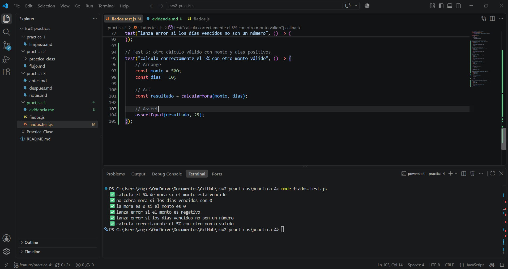

# Evidencia — Práctica 4: Calculadora de fiados (TDD)

## Objetivo
Testear la función `calcularMora(monto, diasVencidos)` usando un mini-runner
de tests hecho a mano (sin frameworks), siguiendo el ciclo TDD: RED → GREEN.

## Función bajo prueba
`calcularMora(monto, diasVencidos)`:
- Si el monto está vencido (`diasVencidos > 0`), cobra el 5% de mora.
- Si no está vencido, la mora es 0.
- Lanza error si el monto es negativo.
- Lanza error si `diasVencidos` no es un número.

## Ciclo TDD
- 🔴 Commit RED: `test(fiados): red — caso monto negativo`
  El test se escribió antes de implementar `fiados.js`, por lo que
  el `require("./fiados")` fallaba al no existir el módulo.
- 🟢 Commit GREEN: `feat(fiados): green — implementa calcularMora`
  Se implementó `fiados.js` y el test pasó.
- 🟢 Commit adicional: `test(fiados): agrega 6 casos AAA — camino feliz y bordes`
  Se completó la suite hasta 6 tests, todos con patrón AAA
  (Arrange–Act–Assert).

## Casos cubiertos (6 tests)
1. Camino feliz: monto=100, días=5 → mora=5
2. Días=0 → mora=0 (no vencido)
3. Monto=0 → mora=0
4. Monto negativo → lanza error
5. Días no numéricos ("cinco") → lanza error
6. Otro cálculo válido: monto=500, días=10 → mora=25

## Resultado de la ejecución

## Comando ejecutado:
node fiados.test.js

## Salida (todos los tests en verde):

✅ calcula el 5% de mora si el monto está vencido
✅ no cobra mora si los días vencidos son 0
✅ la mora es 0 si el monto es 0
✅ lanza error si el monto es negativo
✅ lanza error si los días vencidos no son un número
✅ calcula correctamente el 5% con otro monto válido

## Conclusión
Los 6 tests pasan correctamente, cubriendo camino feliz y casos borde,
con evidencia de haber seguido TDD (test escrito antes de la
implementación, commit RED anterior al commit GREEN).