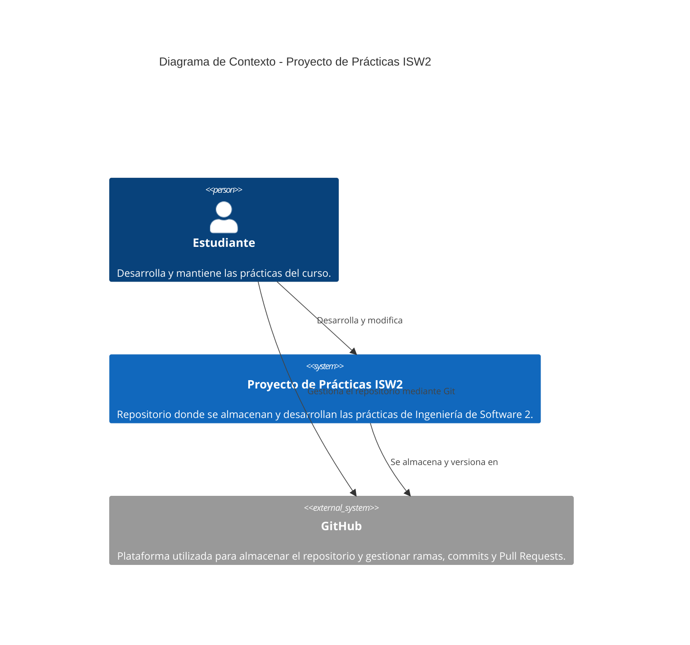

# Práctica 6 - Diagrama C4

## Descripción

Este proyecto corresponde a las prácticas de Ingeniería de Software 2.
En el repositorio se aplican conceptos de control de versiones, testing,
TDD, principios SOLID y refactorización de código.

## Nivel 1 - Diagrama de Contexto


### Justificación

1. Se utiliza GitHub porque se prioriza la **mantenibilidad**, ya que permite conservar el historial de cambios del proyecto.
2. Se utilizan ramas para favorecer la **organización** y reducir el riesgo de afectar directamente la rama principal.
3. Se utiliza Pull Request porque favorece la **calidad**, permitiendo revisar los cambios antes de incorporarlos a `main`.
4. La documentación se mantiene dentro del repositorio para mejorar la **trazabilidad** y facilitar la comprensión del proyecto.
5. La arquitectura prioriza la **mantenibilidad sobre la complejidad**, manteniendo una estructura sencilla y adecuada para las prácticas del curso.

## Nivel 2 - Diagrama de Contenedores

```mermaid
C4Container
    title Diagrama de Contenedores - Proyecto de Prácticas ISW2

    Person(alumno, "Estudiante", "Desarrolla y ejecuta las prácticas.")

    System_Boundary(proyecto, "Proyecto de Prácticas ISW2") {

        Container(codigo, "Código de prácticas", "JavaScript", "Contiene las funciones y ejercicios desarrollados durante las prácticas.")

        Container(tests, "Pruebas", "JavaScript / Node.js", "Contiene las pruebas utilizadas para verificar el comportamiento del código.")

        Container(documentacion, "Documentación", "Markdown", "Contiene explicaciones, diagnósticos, decisiones y evidencias de las prácticas.")
    }

    System_Ext(github, "GitHub", "Plataforma de control de versiones y colaboración")

    Rel(alumno, codigo, "Desarrolla")
    Rel(alumno, tests, "Ejecuta y verifica")
    Rel(alumno, documentacion, "Documenta")

    Rel(codigo, tests, "Es verificado mediante")
    Rel(proyecto, github, "Se versiona mediante Git")
```
### Justificación

1. Se separa el código de las pruebas para mejorar la **testabilidad**, permitiendo verificar el comportamiento sin mezclarlo con la implementación.
2. Se mantiene documentación en Markdown para favorecer la **mantenibilidad**, ya que las decisiones pueden consultarse directamente en el repositorio.
3. El uso de JavaScript y Node.js permite mantener una solución **simple**, adecuada para las prácticas de testing y TDD.
4. La separación entre código, pruebas y documentación favorece la **organización** y reduce el acoplamiento entre responsabilidades.
5. La estructura prioriza la **mantenibilidad sobre el rendimiento**, porque el objetivo principal del proyecto es aprender y aplicar buenas prácticas de desarrollo.

## Correcciones realizadas al borrador generado con IA

Se utilizó IA como apoyo para generar un borrador inicial del diagrama C4.
Posteriormente se revisó el contenido para evitar tecnologías o componentes
que no forman parte del proyecto real.

Las correcciones realizadas fueron:

1. Se eliminó React porque el proyecto de prácticas no utiliza React.
2. Se eliminó Express porque no existe un servidor Express dentro de este repositorio.
3. Se eliminó una base de datos porque las prácticas actuales no utilizan una base de datos.
4. Se mantuvieron JavaScript, Node.js y Markdown porque corresponden a las tecnologías utilizadas en las prácticas.
5. Se representaron las pruebas como un contenedor separado porque el proyecto contiene archivos de testing independientes del código principal.
